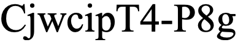
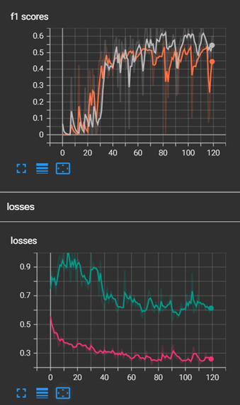
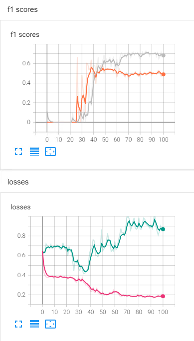
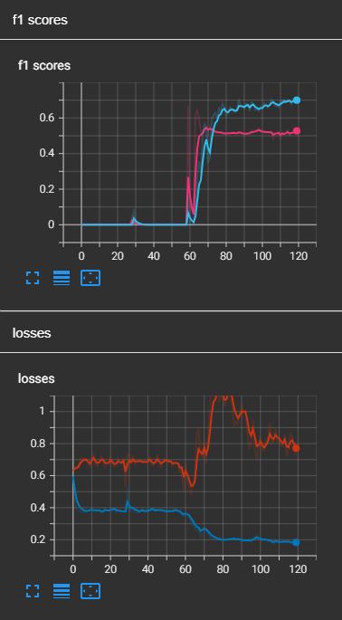
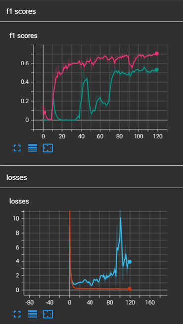

# PointNet (for 3D point segmentation)

## Description
This is a PointNet model made with LiDAR building/tree segmentation in mind.  
It was tested using LiDAR data from Vaihingen, Germany, but still needs to be refined as it at best got the following training, validation, and testing F1 scores: 0.7, 0.53, 0.37.  
Below are details for downloading the data and modifications I made to improve the model.

## Download the data
You can download the Vaihingen data from this link: https://seafile.projekt.uni-hannover.de/f/6a06a837b1f349cfa749/  
  
Note that for this script, data was loaded from the .pts files rather than the actual .las files

## Attempted Improvements/Results
- Used cross entropy instead of negative log likelihood loss. Similar results but F1 score was more volatile
- Used dropout layers. They would either flatline the F1 curve at 0 or make the model perform slightly worse.
- Used dropout for intensity.
- Used linear layers instead of Conv1D. Didn't start learning until epoch ~100.
- Trying no batch/layer normalization LED TO THE BEST F1 SCORES. Loss curves weren't great.
- Tried no batch/layer normalizaion and He weight initialization for Conv1D layers. Loss curve went all over the place.
- Tried rotating the batches for data augmentation. F1 curve flatlined at 0.

Here are some training/validation loss/F1 score curves:
1. Base Program (KDTree Batching, Conv + Linear Layers, LR=0.0005, Adam)  
  
2. No Batch/Layer Normalization; Linear Layers Only  
  
3. No Batch/Layer Normalization; Conv + Linear Layers  
  
4. No Batch/Layer Normalization; He Weight Initialization  
  